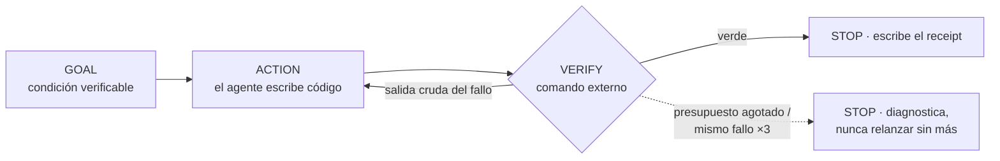

# loop-engineering

[English](README.md) · **Español**

> Deja de promptear a tu agente de código mensaje a mensaje. Declara un
> objetivo, un ámbito, un comando que decide pasa/no-pasa y un presupuesto —
> y deja que el bucle corra hasta que el gate esté en verde o reporte
> honestamente por qué no.

**loop-engineering** empaqueta la metodología [Loop Engineering](https://cocodedk.github.io/loop-engineering/)
como un skill instalable para **Claude Code** y **OpenAI Codex CLI**: un
núcleo compartido (metodología, spec de comandos, plantillas, scripts) y dos
adaptadores finos. Se instala una vez en ámbito global, se inicializa
cualquier proyecto con `start`, y se conduce con 12 comandos.



Mecánica verificada el 2026-07-27 contra **Claude Code CLI 2.1.212** y
**Codex CLI 0.145.0**.

Nota: la conversación con el skill es en tu idioma, pero **todos los
ficheros que genera** (goals, receipts, ADRs, scripts) **se escriben en
inglés** por diseño.

## Índice

1. [Qué es Loop Engineering](#1-qué-es-loop-engineering)
2. [Qué te da este paquete](#2-qué-te-da-este-paquete)
3. [Instalación](#3-instalación)
4. [Quickstart: del spec al primer gate en verde en 10 minutos](#4-quickstart-del-spec-al-primer-gate-en-verde-en-10-minutos)
5. [Referencia de comandos](#5-referencia-de-comandos)
6. [Ficheros que este skill crea en tu proyecto](#6-ficheros-que-este-skill-crea-en-tu-proyecto)
7. [Las reglas](#7-las-reglas)
8. [Claude Code vs Codex](#8-claude-code-vs-codex)
9. [Operación desatendida](#9-operación-desatendida)
10. [Solución de problemas y FAQ](#10-solución-de-problemas-y-faq)
11. [Notas de diseño](#11-notas-de-diseño)

---

## 1. Qué es Loop Engineering

Dejas de escribir prompts individuales y construyes **bucles verificados**:
*objetivo → acción → feedback → condición de parada*. El bucle solo avanza
cuando pasa un **gate de verificación externo** — la sesión que escribe el
código nunca decide por sí misma que ha terminado.

Todo bucle declara seis campos antes de empezar:

| Campo | Significado |
|---|---|
| `GOAL` | Una frase, una *condición verificable* — nunca una lista de tareas |
| `SCOPE` | La unidad acotada (módulo/paquete/servicio); los gates nunca corren a nivel de proyecto salvo en el cierre de milestone |
| `VERIFY` | El comando exacto que decide pasa/no-pasa; debe poder fallar y debe *ejecutar* el comportamiento, no solo compilarlo o lintarlo |
| `BUDGET` | Techo de iteraciones (por defecto 8–10), opcionalmente tiempo/coste |
| `STOP` | Gate en verde, o N fallos idénticos consecutivos (por defecto 3), o presupuesto agotado |
| `RECEIPT` | El fichero donde queda registrada la ejecución |

Un bucle al que le falta un campo no es un bucle; es una conversación sin
final.

**Origen.** Boris Cherny (creador de Claude Code) describiendo su propia
forma de trabajar: *"I don't prompt Claude anymore. I have loops that are
running… My job is to write loops."* Terceros lo etiquetaron como "loop
engineering"; la etiqueta es marketing, la mecánica es real. Guía del
método: [cocodedk/loop-engineering](https://github.com/cocodedk/loop-engineering).

## 2. Qué te da este paquete

- **`core/`** — la única fuente de verdad a la que remiten ambos
  adaptadores:
  - [`METHODOLOGY.md`](core/METHODOLOGY.md) — anatomía del bucle,
    principios de verificación, las cuatro capas de memoria, presupuestos y
    protocolo de atasco, orquestación, cuándo *no* usar bucles.
  - [`COMMANDS.md`](core/COMMANDS.md) — el spec canónico de comportamiento
    de los 12 comandos.
  - [`templates/`](core/templates/) — mapa de goals, ledger de estado,
    receipt, ADR, working agreement, brief de proyecto.
  - [`scripts/`](core/scripts/) — `verify-loop.sh` (runner headless de
    actuar→verificar→re-promptear) y `stop-verify.sh` (gate de stop hook
    para Claude Code).
- **`claude-code/`** — adaptador fino: comandos `/le:*`, un skill de
  lenguaje natural, y este repo funciona además como **marketplace de
  plugins** instalable.
- **`codex/`** — adaptador fino: prompts `/prompts:le-*`, un skill para
  invocación implícita, y un snippet para `AGENTS.md`.
- **`install.sh`** — instalador idempotente para ambas herramientas, global
  o por proyecto.

Todo lo que el skill genera después dentro de tus proyectos es en inglés,
agnóstico de stack, y basado en ficheros — cualquier sesión futura retoma
desde ficheros, no desde la memoria de nadie.

## 3. Instalación

### Como plugin de Claude Code (una línea)

Este repositorio es un marketplace de plugins de Claude Code:

```text
/plugin marketplace add lcajigasm/loop-engineering
/plugin install loop-engineering@loop-engineering
```

Los comandos del plugin llevan el namespace del plugin:
`/loop-engineering:le:start`, `/loop-engineering:le:auto`, … (verificado en
Claude Code 2.1.212). El skill de lenguaje natural funciona igual que con
la instalación por script, que a cambio da los nombres cortos `/le:*`. El
plugin no tiene versión explícita: cada commit a `main` cuenta como versión
nueva, así que `/plugin update` sigue el repo. `core/` llega al plugin por
un symlink interno del repo — en Windows, clona con symlinks habilitados o
usa la instalación por script.

Codex no tiene un marketplace abierto equivalente; usa el script o la
instalación manual (una instalación directa del skill por URL de GitHub se
quedaría sin `core/`, que en este repo vive fuera del directorio del skill).

### Script

```bash
./install.sh              # ambas herramientas, ámbito personal/global (por defecto)
./install.sh --claude     # solo Claude Code
./install.sh --codex      # solo Codex
./install.sh --project ~/src/myapp   # instalación por proyecto
./install.sh --force      # sobreescribe ficheros que modificaste localmente
```

Idempotente: re-ejecutarlo actualiza en sitio los ficheros no modificados,
y se niega a sobreescribir los que editaste — un manifest de checksums
(`.installed-manifest` en cada directorio de skill) distingue "versión
antigua que instalamos" de "modificado por el usuario" — salvo con
`--force`.

Qué se instala dónde (ámbito global):

| Herramienta | Ruta | Te da |
|---|---|---|
| Claude Code | `~/.claude/skills/loop-engineering/` (SKILL.md + `core/`) | activación por lenguaje natural + el core compartido |
| Claude Code | `~/.claude/commands/le/*.md` | `/le:start`, `/le:auto`, … |
| Codex | `~/.codex/skills/loop-engineering/` (SKILL.md + `core/`) | skill implícito + el core compartido |
| Codex | `~/.codex/prompts/le-*.md` | `/prompts:le-start`, … |

`--project <path>` instala en `<path>/.claude/{skills,commands}` y
`<path>/.agents/skills/loop-engineering`, de modo que el skill viaja con el
repo. Los custom prompts de Codex no tienen ámbito de proyecto y ahí se
omiten.

### Manual

Copia los mismos árboles a mano:

```bash
# Claude Code
mkdir -p ~/.claude/skills/loop-engineering ~/.claude/commands
cp claude-code/skills/loop-engineering/SKILL.md ~/.claude/skills/loop-engineering/
cp -R core ~/.claude/skills/loop-engineering/core
cp -R claude-code/commands/le ~/.claude/commands/le

# Codex
mkdir -p ~/.codex/skills/loop-engineering ~/.codex/prompts
cp codex/skills/loop-engineering/SKILL.md ~/.codex/skills/loop-engineering/
cp -R core ~/.codex/skills/loop-engineering/core
cp codex/prompts/*.md ~/.codex/prompts/
```

### Desinstalación

```bash
# instalación como plugin
claude plugin uninstall loop-engineering
# instalación por script/manual
rm -rf ~/.claude/skills/loop-engineering ~/.claude/commands/le
rm -rf ~/.codex/skills/loop-engineering ~/.codex/prompts/le-*.md
```

Los ficheros generados *dentro* de tus proyectos (`docs/GOALS.md`,
receipts, …) son tuyos; desinstalar el skill no los toca nunca.

## 4. Quickstart: del spec al primer gate en verde en 10 minutos

Los comandos se muestran como `/le:*` (instalación por script); con el
plugin, prefíjalos como `/loop-engineering:le:*`.

```text
tú>     /le:start docs/spec.md

claude> [Fase 1 — Ingesta] Leído docs/spec.md (una app de todos por CLI,
        3 áreas funcionales).
        [Fase 2 — Aclaración] Un lote de preguntas antes de generar:
        1. Corte de milestones — propongo M1 CRUD básico, M2
           persistencia+búsqueda, M3 empaquetado. ¿OK?
        2. Tooling de verificación — encontré pytest y ruff en
           pyproject.toml. ¿Confirmas "ruff check src && pytest
           tests/<area>" como patrón de gate acotado?
        3. Presupuestos — ¿por defecto 10 iteraciones / 3 fallos idénticos?
        4. ¿Bucles paralelos con worktrees, o estrictamente secuencial?
        5. No veo config de CI — ¿correcto?
        6. Definición de hecho: un goal pasa solo cuando sus tests ejecutan
           el comportamiento. "Compila/linta" no cuenta nunca. ¿Confirmas?
        7. El spec dice "búsqueda rápida" — sin número. ¿Cuál es el
           objetivo?

tú>     1 sí · 2 sí · 3 sí · 4 secuencial · 5 correcto · 6 confirmo
        7 <100ms con 10k elementos

claude> [Fase 3 — Generación] Creados: docs/GOALS.md (14 goals en 3
        milestones), docs/STATUS.md, docs/receipts/TEMPLATE.md,
        docs/adr/0001-adopt-loop-engineering.md, Working Agreement añadido
        a CLAUDE.md y AGENTS.md, scripts/verify-loop.sh.
        ¿Cableo el stop hook (.claude/hooks/stop-verify.sh)?

tú>     sí

claude> [Fase 4 — Entrega] El primer goal sería G-101 "añadir/listar/
        completar un todo vía CLI, estado en memoria" — sin dependencias,
        todo lo demás se construye encima:
          GOAL    añadir/listar/completar funcionan de punta a punta vía CLI
          SCOPE   src/todo
          VERIFY  ruff check src && pytest tests/todo
          BUDGET  10 iteraciones, parar tras 3 fallos idénticos
          STOP    verde | atascado | presupuesto
          RECEIPT docs/receipts/G-101-core-crud.md
        ¿Lo lanzo? (o ejecuta /le:auto cuando quieras)

tú>     /le:auto
        …el bucle corre: implementar → verificar → arreglar → verificar → verde…

claude> G-101 pasó en 3 iteraciones. Receipt escrito en
        docs/receipts/G-101-core-crud.md. Siguiente elegible: G-102.
```

Después lee ese primer receipt — es el artefacto que permite que la sesión
de mañana retome sin que tengas que volver a explicar nada.

## 5. Referencia de comandos

Todos los comandos existen en ambos adaptadores. El spec de comportamiento
completo vive en [core/COMMANDS.md](core/COMMANDS.md); esto es la vista del
operador.

| Comando | En una línea |
|---|---|
| `start` `[file\|url]` | Inicializa el proyecto desde un doc, URL o entrevista |
| `plan` | Re-planifica el mapa de goals tras cambios de alcance |
| `auto` | Retoma exactamente donde quedó el proyecto; corre el siguiente bucle elegible |
| `goal` `<id\|desc>` | Ejecuta un bucle concreto |
| `verify` `<scope\|id>` | Corre un gate, reporta la salida cruda, no arregla nada |
| `status` | Dashboard de solo lectura + "ejecuta esto ahora" |
| `receipt` `<goal-id>` | Escribe/completa el receipt de un bucle |
| `stuck` `<goal-id>` | Diagnostica un bucle atascado (nunca solo sube el presupuesto) |
| `close-milestone` `<id>` | Receipts → gate completo → STATUS → release notes → propuesta de tag |
| `memory` `<lección>` | Promueve una corrección a memoria durable |
| `parallel` | Propone bucles concurrentes en ámbitos disjuntos |
| `help` | El método + qué ejecutar ahora mismo |

### start `[file|url]`

Cuatro fases, ninguna se salta: **Ingesta** (lee md/txt/html/pdf/docx o una
URL, o te entrevista y escribe `docs/PROJECT_BRIEF.md`), **Aclaración** (una
única lista numerada de preguntas — corte de milestones, tooling de
verificación por área, presupuestos, apetito de paralelismo, CI, definición
de hecho, ambigüedades — y espera), **Generación** (mapa de goals, status,
directorio de receipts, ADR 0001, working agreement en CLAUDE.md+AGENTS.md,
verify-loop.sh, stop hook opcional), **Entrega** (muestra los seis campos
del primer goal; no arranca sin confirmación).

Idempotente: en un proyecto ya inicializado ofrece re-planificar, y nunca
destruye receipts, ADRs ni el historial de goals.
*Modos de fallo*: formato ilegible → lo dice y pide una alternativa; spec
ambiguo → la ambigüedad se convierte en pregunta de Fase 2, no en una
suposición.

### plan

Re-planifica sin re-inicializar. Propone un delta — ids nuevos para goals
nuevos, marcas `dropped` en vez de borrados — mantiene el historial solo de
adición, registra la revisión, y se niega a correr si aún no hay mapa de
goals.

### auto

El comando de reanudación; seguro de ejecutar en cualquier momento, las
veces que haga falta. Reconstruye el estado desde ficheros (goals,
receipts, status, git log), reporta y corrige inconsistencias, anuncia el
siguiente goal elegible (goal, por qué, VERIFY, presupuesto) *antes de
tocar código*, corre el bucle realimentando la salida cruda de cada fallo,
cierra con receipt + marca del goal + actualización de status, nombra el
siguiente goal, y para. ¿Nada elegible? Dice exactamente por qué: goals
atascados, dependencias sin cumplir, o un milestone listo para cerrar.

### goal `<id|descripción>`

Ejecuta un bucle concreto. Por id carga los seis campos de `GOALS.md` —
rechaza goals `[x]` (ofrece `verify`) y `[!]` (te manda a `stuck`). Por
descripción construye los seis campos contigo, y ofrece añadir el goal al
mapa para que la ejecución deje rastro. Los goals `Verify: human` terminan
en una comprobación manual guiada cuyo resultado aportas tú.

### verify `<scope|goal-id>`

Corre el gate, muestra la salida **cruda**, no arregla **nada**. Es el juez
independiente — ejecútalo después de que cualquier bucle diga que terminó;
el generador nunca se audita a sí mismo. Un gate en rojo aquí es un
informe, no una tarea.

### status

Dashboard de solo lectura: progreso por milestone, bucle activo,
inconsistencias encontradas, qué es elegible a continuación, y una
recomendación de una línea: "ejecuta esto ahora".

### receipt `<goal-id>`

Escribe o completa un receipt (p. ej. cuando `verify-loop.sh` solo registró
los campos del runner). Pregunta en vez de inventar lo que no se puede
reconstruir con evidencia — especialmente la observación humana en goals
`Verify: human`.

### stuck `<goal-id>`

El comando de diagnóstico. Clasifica la causa — **gate mal diseñado /
dependencia ausente / goal ambiguo / problema de entorno** (el clásico: un
repo de test sin `user.name` configurado que falla cada commit; el código
nunca fue el problema) — y propone exactamente un remedio: VERIFY
corregido, edición de dependencias, goal reformulado o partido en dos, o un
ADR.

### close-milestone `<id>`

Comprueba que todos los receipts del milestone dicen `passed` (si no, para
y lista exactamente qué falta), corre el gate completo del proyecto,
actualiza STATUS.md, redacta las release notes, propone el tag — y espera
confirmación humana antes de que exista ningún tag.

### memory `<lección>`

Promueve una corrección a la capa durable: hechos → `CLAUDE.md` +
`AGENTS.md` (dentro de los marcadores gestionados), procedimientos → un
skill de proyecto, decisiones → redirigidas a un ADR. Muestra el texto
exacto antes de aplicar; rechaza duplicados.

### parallel

Lee los goals pendientes, propone cuáles pueden correr en paralelo (solo
ámbitos disjuntos), y emite los comandos de lanzamiento — `claude
--worktree <slug>` + `/le:goal G-xxx` por goal en Claude Code; un plan
secuencial alternativo en Codex. Solo planifica; no ejecuta nada.

### help

El método en pocas frases, la lista de comandos, y una recomendación de
"qué deberías ejecutar ahora mismo" según el estado real del proyecto.

## 6. Ficheros que este skill crea en tu proyecto

```
docs/
├── GOALS.md              # el mapa exhaustivo de goals — todos, con forma de bucle
├── STATUS.md             # lo que existe de verdad; se actualiza con el cambio que altera comportamiento
├── PROJECT_BRIEF.md      # la fuente funcional (la escribe la entrevista de start)
├── receipts/             # un fichero por ejecución de bucle + TEMPLATE.md
└── adr/                  # decisiones numeradas; la 0001 registra la adopción del método
scripts/verify-loop.sh    # runner headless de bucles, gates adaptados a tu stack
CLAUDE.md / AGENTS.md     # Working Agreement añadido entre marcadores gestionados
.claude/hooks/stop-verify.sh + .claude/settings.json   # stop hook (opcional)
.le-active-verify         # marcador transitorio: el gate del bucle en curso (gitignored)
```

### Las cuatro capas de memoria

| Capa | Guarda | Se escribe cuando |
|---|---|---|
| `CLAUDE.md` / `AGENTS.md` | correcciones durables, reglas de trabajo | un bucle falla dos veces por la misma razón evitable |
| `docs/adr/` | decisiones: contexto, alternativas, consecuencias | se toma o revierte una decisión de calado (se supersede, nunca se reescribe) |
| `docs/STATUS.md` | lo que existe de verdad, por área | en el mismo cambio que altera comportamiento |
| `docs/receipts/` | una ejecución de bucle: iteraciones, fallos, arreglos, resultado | al cerrar (o abandonar) cada bucle |

Los receipts son el mecanismo de reanudación: la siguiente sesión los lee
en vez de preguntarte qué pasó.

### Formato de GOALS.md

```markdown
# Goals — <project name>

> Generated by loop-engineering from <source doc> on <date>.
> Defaults: budget 10 iterations, stop after 3 identical failures.
> Legend: [ ] pending · [~] in progress · [x] passed · [!] stuck · [$] budget-exhausted

## M1 — <milestone name> (target: <version/tag>)

### G-101 — <one-sentence verifiable goal>
- Scope: <module/package>
- Verify: `<exact command>`
- Budget: 10 · Depends on: — · Parallelizable with: G-102
- Status: [ ] · Receipt: docs/receipts/G-101-<slug>.md
```

Reglas: los ids de goal son estables y nunca se reutilizan; todo goal tiene
forma de bucle; un goal sin gate ejecutable se marca `Verify: human —
<comprobación manual>` y su receipt registra quién comprobó (el patrón para
IME, lectores de pantalla, temas visuales); todo VERIFY debe ser ejecutable
tal cual está escrito; todo milestone termina con un goal de cierre que
corre el gate completo del proyecto; las dependencias entre milestones se
permiten pero se señalan — suelen indicar que el corte de milestones está
mal.

## 7. Las reglas

1. **Nada simulado** — un stub que devuelve datos plausibles esconde un
   fallo; un fallo visible se arregla.
2. **Decide el gate, no el generador** — la autoevaluación converge en
   "parece hecho"; un comando externo converge en *está* hecho.
3. **Verificaciones acotadas** — un gate de proyecto completo en cada
   iteración oculta qué cambio rompió qué, y hace que cada bucle pague por
   el mundo entero.
4. **Presupuestos siempre** — un bucle sin techo convierte un gate mal
   diseñado en una factura infinita.
5. **Atascado → diagnostica, no relances** — el mismo fallo tres veces
   significa que el bucle no está aprendiendo; más iteraciones no compran
   nada.
6. **Disciplina de memoria** — una corrección que no se escribe la repetirá
   la siguiente sesión.
7. **Objetivo inalcanzable → para y reporta** — el fallo honesto es más
   barato que la simulación plausible, siempre.

## 8. Claude Code vs Codex

Verificado el 2026-07-27 contra **Claude Code CLI 2.1.212** y **Codex CLI
0.145.0** (la mecánica cambia entre versiones — mira
[Solución de problemas](#10-solución-de-problemas-y-faq) si una invocación
deja de coincidir):

| Capacidad | Claude Code | Codex | Compensación en Codex |
|---|---|---|---|
| Comandos con argumentos | `/le:<name>` (`~/.claude/commands/le/`) | `/prompts:le-<name>` (`~/.codex/prompts/`; deprecados upstream pero funcionales, y el único mecanismo de Codex con argumentos) | se instala también el skill para activación por lenguaje natural |
| Invocación implícita / lenguaje natural | skill (`~/.claude/skills/`) | skill (`~/.codex/skills/`, estándar Agent Skills; sin argumentos) | los prompts cubren la invocación explícita |
| Distribución vía marketplace de plugins | sí — este repo | sin marketplace abierto | repo de GitHub + install.sh |
| Stop hook (bloquea el "hecho" con gate en rojo) | sí (`.claude/settings.json`, exit 2) | **sin hooks** | auto-comprobación obligatoria en el spec de cada comando: re-ejecutar VERIFY en una invocación fresca antes de declarar hecho; pegar la salida en verde en el receipt |
| Worktrees paralelos | `claude --worktree <name>` | **sin flag de worktree** | `parallel` emite un plan secuencial alternativo (`git worktree` manual es posible pero sin gestión) |
| Scheduler | `/schedule`, tareas programadas | **ninguno** | cron externo + `codex exec`, o dejar el trabajo desatendido del lado de Claude Code |
| Runner headless de bucles | `claude -p` + `--resume` (verify-loop.sh) | `codex exec` existe pero verify-loop.sh apunta al CLI de Claude | correr verify-loop.sh con Claude Code, o conducir los bucles interactivamente |
| Instalación por proyecto | `.claude/{skills,commands}` | `.agents/skills/` (solo skills; los prompts son solo globales) | el snippet de AGENTS.md hace que cualquier sesión sea consciente del método |

Ambos adaptadores leen el mismo `core/`; ningún texto de metodología está
duplicado.

## 9. Operación desatendida

- **Bucles headless**:

  ```bash
  ./scripts/verify-loop.sh \
    --goal "all parser unit tests pass" \
    --verify "npx tsc --noEmit && npx vitest run src/parser" \
    --max 10 --receipt docs/receipts/G-101-parser.md
  ```

  ejecuta el ciclo actuar→verificar→re-promptear con `claude -p`,
  reanudando una misma sesión entre iteraciones, y escribe él mismo el
  receipt (`passed` / `stuck` / `budget-exhausted`).
- **Programación**: envuelve esa invocación en cron/launchd o en una tarea
  programada de Claude Code ("cada noche: corre /le:status; si hay un goal
  elegible, corre /le:auto").
- **Salvaguardas extra cuando nadie mira** — todas innegociables:
  - presupuestos duros en los tres techos, *incluido tiempo/coste*;
  - restringe herramientas (`--allowed-tools`; por defecto
    `Read,Edit,Write,Bash` — acótalo a tu stack, p. ej.
    `Read,Edit,Bash(npm *)`);
  - **abre un issue en vez de forzar un PR**: un bucle desatendido que no
    consigue el verde dentro del presupuesto archiva el informe del fallo y
    para — nunca baja el listón para publicar;
  - nunca apuntes un bucle desatendido a un goal `Verify: human`.

## 10. Solución de problemas y FAQ

**Un bucle está atascado.** Ejecuta `stuck <goal-id>`. La respuesta es un
diagnóstico (gate malo / dependencia ausente / goal ambiguo / entorno),
nunca un presupuesto más grande.

**Mi gate no puede fallar.** Entonces no es un gate. Un `echo ok`, un
check solo de lint, o un test sin aserciones dejan que el bucle converja en
algo que solo *parece* hecho. Reescribe el VERIFY de forma que borrar la
implementación lo ponga en rojo — ese es el test del test.

**El verify es flaky.** Un gate que falla 1 de cada 5 ejecuciones
envenena el contador de fallos idénticos y quema presupuesto. Arregla
primero el flake (es un bug real — normalmente timing o estado compartido),
o fija el bucle al subconjunto determinista y trackea el test flaky como su
propio goal.

**La suite de tests tarda 20 minutos.** ¡Acota el gate! Los gates por goal
corren solo el módulo del goal (`pytest tests/todo`, `cargo test -p
ese-crate`, `vitest run src/parser`); la suite completa corre una vez, en
`close-milestone`. Pon delante el filtro estático barato (`tsc --noEmit`,
`cargo check`, `ruff`+`mypy`) para que el código roto nunca pague una
ejecución de tests.

**Monorepos.** SCOPE es tu aliado: un paquete = un scope, los goals
declaran las dependencias entre paquetes explícitamente, y `parallel` solo
empareja goals de paquetes disjuntos. Instala por proyecto (`--project`) si
distintos repos necesitan versiones distintas del skill.

**`start` dice que el proyecto ya está inicializado.** Es la guarda de
idempotencia. Usa `plan` para re-planificar; nada sobreescribirá receipts,
ADRs ni el historial de goals.

**El stop hook no deja terminar mi sesión.** Bloquea mientras
`.le-active-verify` apunte a un gate en rojo, y suelta tras 3 intentos
bloqueados con instrucciones. Si el bucle está genuinamente abandonado:
registra el receipt como `stuck` y borra `.le-active-verify`.

**Un nombre de comando o un flag dejó de funcionar tras una
actualización.** Ambos CLIs cambian entre versiones. Revisa `claude
--help` / la doc de hooks (Claude) y la doc de prompts/skills (Codex); los
ficheros a ajustar son los adaptadores finos, nunca `core/`.

## 11. Notas de diseño

**Por qué receipts.** Las ventanas de contexto se acaban; los ficheros no.
Un receipt es el artefacto más barato que permite a la siguiente sesión (o
al siguiente humano) retomar sin re-explicar — qué modos de fallo ya se
visitaron, cuál fue el arreglo, dónde se quedó el trabajo. Es además la
entrada que lee el protocolo de atasco.

**Por qué el generador nunca juzga.** Un modelo que escribió el código
tiene todos los puntos ciegos con forma de incentivo para creer que
funciona. Un comando externo no tiene ninguno. El método entero es esa
separación más contabilidad.

**Por qué los presupuestos no son negociables.** El modo de fallo de los
bucles verificados no es el código incorrecto — eso lo caza el gate — sino
el *gasto sin límite en un bucle que no puede converger*. Los presupuestos
lo convierten en un evento acotado y diagnosticable, con receipt.

**Cuándo no usar bucles.** Trabajo exploratorio o de diseño (el resultado
es comprensión, no un gate en verde), ediciones triviales de un solo paso
(la sobrecarga supera al trabajo), y trabajo cuya verificación es
inherentemente humana (diseño visual, redacción) — los comandos te lo dirán
en vez de forzar el patrón.

---

Créditos: guía de la metodología por [cocodedk](https://github.com/cocodedk/loop-engineering);
workflow original de Boris Cherny. Este paquete generaliza el montaje real
de un proyecto vivo (un editor en Rust) en un skill instalable y agnóstico
de stack.
