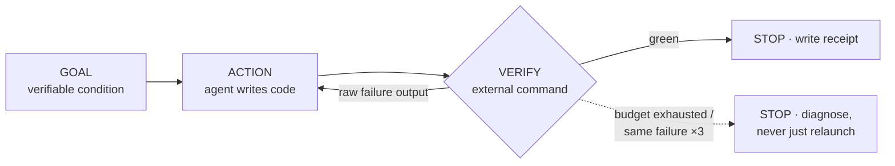

# loop-engineering

**English** · [Español](README.es.md)

> Stop prompting your coding agent one message at a time. Declare a goal, a
> scope, a command that decides pass/fail, and a budget — then let the loop
> run until the gate is green or it honestly reports why not.

**loop-engineering** packages the [Loop Engineering](https://cocodedk.github.io/loop-engineering/)
methodology as an installable skill for **Claude Code** and **OpenAI Codex
CLI**: one shared core (methodology, command spec, templates, scripts), two
thin adapters. Install once globally, initialize any project with `start`,
drive it with 12 commands.



Mechanics verified 2026-07-27 against **Claude Code CLI 2.1.212** and
**Codex CLI 0.145.0**.

## Table of contents

1. [What is Loop Engineering](#1-what-is-loop-engineering)
2. [What this package gives you](#2-what-this-package-gives-you)
3. [Installation](#3-installation)
4. [Quickstart: spec to first green gate in 10 minutes](#4-quickstart-spec-to-first-green-gate-in-10-minutes)
5. [Command reference](#5-command-reference)
6. [Files this skill creates in your project](#6-files-this-skill-creates-in-your-project)
7. [The rules](#7-the-rules)
8. [Claude Code vs Codex](#8-claude-code-vs-codex)
9. [Unattended operation](#9-unattended-operation)
10. [Troubleshooting & FAQ](#10-troubleshooting--faq)
11. [Design notes](#11-design-notes)

---

## 1. What is Loop Engineering

You stop writing individual prompts and construct **verified loops**:
*goal → action → feedback → stopping condition*. The loop only advances when
an **external verification gate** passes — the session that writes the code
never decides for itself that it's done.

Every loop declares six fields before it starts:

| Field | Meaning |
|---|---|
| `GOAL` | One sentence, a *verifiable condition* — never a task list |
| `SCOPE` | The bounded unit (module/package/service); gates never run project-wide except at milestone close |
| `VERIFY` | The exact command that decides pass/fail; it must be able to fail, and it must *execute* the behavior, not merely compile or lint it |
| `BUDGET` | Iteration ceiling (default 8–10), optionally time/cost |
| `STOP` | Green gate, or N identical consecutive failures (default 3), or budget exhausted |
| `RECEIPT` | The file where the run is recorded |

A loop with a missing field is not a loop; it's an open-ended conversation.

**Origin.** Boris Cherny (creator of Claude Code) describing his own
workflow: *"I don't prompt Claude anymore. I have loops that are running… My
job is to write loops."* Third parties labeled it "loop engineering"; the
label is marketing, the mechanics are real. Method guide:
[cocodedk/loop-engineering](https://github.com/cocodedk/loop-engineering).

## 2. What this package gives you

- **`core/`** — the single source of truth both adapters defer to:
  - [`METHODOLOGY.md`](core/METHODOLOGY.md) — loop anatomy, verification
    principles, the four memory layers, budgets and the stuck protocol,
    orchestration, when *not* to loop.
  - [`COMMANDS.md`](core/COMMANDS.md) — the canonical behavioral spec of all
    12 commands.
  - [`templates/`](core/templates/) — goal map, status ledger, receipt, ADR,
    working agreement, project brief.
  - [`scripts/`](core/scripts/) — `verify-loop.sh` (headless
    act→verify→re-prompt runner) and `stop-verify.sh` (Claude Code stop-hook
    gate).
- **`claude-code/`** — thin adapter: `/le:*` commands, a natural-language
  skill, and this repo doubles as an installable **plugin marketplace**.
- **`codex/`** — thin adapter: `/prompts:le-*` prompts, a skill for implicit
  invocation, and an `AGENTS.md` snippet.
- **`install.sh`** — idempotent installer for both tools, global or
  per-project.

Everything the skill later generates inside your projects is English,
stack-agnostic, and file-based — any future session resumes from files, not
from anyone's memory.

## 3. Installation

### As a Claude Code plugin (one-liner)

This repository is a Claude Code plugin marketplace:

```text
/plugin marketplace add lcajigasm/loop-engineering
/plugin install loop-engineering@loop-engineering
```

Plugin commands are namespaced by the plugin: `/loop-engineering:le:start`,
`/loop-engineering:le:auto`, … (verified on Claude Code 2.1.212). The
natural-language skill works identically to the script install, which gives
you the shorter `/le:*` names instead. The plugin has no explicit version:
every commit to `main` counts as a new version, so `/plugin update` tracks
the repo. `core/` reaches the plugin through an in-repo symlink — on
Windows, clone with symlinks enabled or use the script install.

Codex has no equivalent open marketplace; use the script or manual install
(a direct GitHub-URL skill install would miss `core/`, which sits outside
the skill directory in this repo).

### Script

```bash
./install.sh              # both tools, personal/global scope (default)
./install.sh --claude     # Claude Code only
./install.sh --codex      # Codex only
./install.sh --project ~/src/myapp   # per-project install instead
./install.sh --force      # overwrite files you modified locally
```

Idempotent: re-running updates unmodified files in place, and refuses to
overwrite files you edited — a checksum manifest (`.installed-manifest` in
each skill dir) distinguishes "old version we installed" from
"user-modified" — unless you pass `--force`.

What lands where (global scope):

| Tool | Path | Gives you |
|---|---|---|
| Claude Code | `~/.claude/skills/loop-engineering/` (SKILL.md + `core/`) | natural-language triggering + the shared core |
| Claude Code | `~/.claude/commands/le/*.md` | `/le:start`, `/le:auto`, … |
| Codex | `~/.codex/skills/loop-engineering/` (SKILL.md + `core/`) | implicit skill + the shared core |
| Codex | `~/.codex/prompts/le-*.md` | `/prompts:le-start`, … |

`--project <path>` installs to `<path>/.claude/{skills,commands}` and
`<path>/.agents/skills/loop-engineering` instead, so the skill travels with
the repo. Codex custom prompts have no project scope and are skipped there.

### Manual

Copy the same trees by hand:

```bash
# Claude Code
mkdir -p ~/.claude/skills/loop-engineering ~/.claude/commands
cp claude-code/skills/loop-engineering/SKILL.md ~/.claude/skills/loop-engineering/
cp -R core ~/.claude/skills/loop-engineering/core
cp -R claude-code/commands/le ~/.claude/commands/le

# Codex
mkdir -p ~/.codex/skills/loop-engineering ~/.codex/prompts
cp codex/skills/loop-engineering/SKILL.md ~/.codex/skills/loop-engineering/
cp -R core ~/.codex/skills/loop-engineering/core
cp codex/prompts/*.md ~/.codex/prompts/
```

### Uninstall

```bash
# plugin install
claude plugin uninstall loop-engineering
# script/manual install
rm -rf ~/.claude/skills/loop-engineering ~/.claude/commands/le
rm -rf ~/.codex/skills/loop-engineering ~/.codex/prompts/le-*.md
```

Files generated *inside* your projects (`docs/GOALS.md`, receipts, …) are
yours; uninstalling the skill never touches them.

## 4. Quickstart: spec to first green gate in 10 minutes

Commands shown as `/le:*` (script install); with the plugin, prefix them as
`/loop-engineering:le:*`.

```text
you>    /le:start docs/spec.md

claude> [Phase 1 — Ingest] Read docs/spec.md (a CLI todo app, 3 areas).
        [Phase 2 — Clarify] One batch of questions before generating:
        1. Milestone cut — I propose M1 core CRUD, M2 persistence+search,
           M3 packaging. OK?
        2. Verify tooling — I found pytest and ruff in pyproject.toml.
           Confirm "ruff check src && pytest tests/<area>" as the scoped
           gate pattern?
        3. Budgets — default 10 iterations / 3 identical failures?
        4. Parallel loops via worktrees, or strictly sequential?
        5. No CI config found — correct?
        6. Definition of done: a goal passes only when its tests execute
           the behavior. "It compiles/lints" never counts. Confirm?
        7. The spec says "fast search" — no number. What's the target?

you>    1 yes · 2 yes · 3 yes · 4 sequential · 5 correct · 6 confirm
        7 <100ms on 10k items

claude> [Phase 3 — Generate] Created: docs/GOALS.md (14 goals across 3
        milestones), docs/STATUS.md, docs/receipts/TEMPLATE.md,
        docs/adr/0001-adopt-loop-engineering.md, Working Agreement appended
        to CLAUDE.md and AGENTS.md, scripts/verify-loop.sh.
        Wire the stop hook (.claude/hooks/stop-verify.sh)?

you>    yes

claude> [Phase 4 — Handoff] First goal would be G-101 "add/list/complete a
        todo via the CLI, state in memory" — no dependencies, everything
        else builds on it:
          GOAL    add/list/complete work end-to-end via the CLI
          SCOPE   src/todo
          VERIFY  ruff check src && pytest tests/todo
          BUDGET  10 iterations, stop after 3 identical failures
          STOP    green | stuck | budget
          RECEIPT docs/receipts/G-101-core-crud.md
        Start it? (or run /le:auto whenever you're ready)

you>    /le:auto
        …loop runs: implement → verify → fix → verify → green…

claude> G-101 passed in 3 iterations. Receipt written to
        docs/receipts/G-101-core-crud.md. Next eligible: G-102.
```

Then read that first receipt — it's the artifact that lets tomorrow's
session resume without you re-explaining anything.

## 5. Command reference

Every command exists in both adapters. Full behavioral specs live in
[core/COMMANDS.md](core/COMMANDS.md); this is the operator's view.

| Command | One line |
|---|---|
| [`start`](#start-fileurl) `[file\|url]` | Initialize the project from a doc, URL, or interview |
| [`plan`](#plan) | Re-plan the goal map after scope changes |
| [`auto`](#auto) | Resume exactly where the project was left; run the next eligible loop |
| [`goal`](#goal-iddescription) `<id\|desc>` | Run one specific loop |
| [`verify`](#verify-scopegoal-id) `<scope\|id>` | Run a gate, report raw output, fix nothing |
| [`status`](#status) | Read-only dashboard + "run this now" |
| [`receipt`](#receipt-goal-id) `<goal-id>` | Write/complete a loop's receipt |
| [`stuck`](#stuck-goal-id) `<goal-id>` | Diagnose a stuck loop (never just raises the budget) |
| [`close-milestone`](#close-milestone-id) `<id>` | Receipts check → full gate → STATUS → release notes → tag proposal |
| [`memory`](#memory-lesson) `<lesson>` | Promote a correction to durable memory |
| [`parallel`](#parallel) | Propose concurrent loops in disjoint scopes |
| [`help`](#help) | The method + what to run right now |

### start `[file|url]`

Four phases, never skipped: **Ingest** (reads md/txt/html/pdf/docx or a
URL, or interviews you into `docs/PROJECT_BRIEF.md`), **Clarify** (one
batched numbered list of questions — milestone cut, verify tooling per
area, budgets, parallelism appetite, CI, definition of done, ambiguities —
then waits), **Generate** (goal map, status, receipts dir, ADR 0001,
working agreement in CLAUDE.md+AGENTS.md, verify-loop.sh, optional stop
hook), **Handoff** (shows the first goal's six fields; won't start without
confirmation).

Idempotent: on an initialized project it offers re-plan instead, and never
destroys receipts, ADRs or goal history.
*Failure modes*: unreadable format → says so and asks for an alternative;
ambiguous spec → the ambiguity becomes a Phase-2 question, not a guess.

### plan

Re-plan without re-initializing. Proposes a delta — new ids for new goals,
`dropped` marks instead of deletions — keeps history append-only, records
the revision, and refuses to run if there's no goal map yet.

### auto

The resume command; safe to run at any moment, repeatedly. Reconstructs
state from files (goals, receipts, status, git log), reports and fixes
inconsistencies, announces the next eligible goal (goal, why, VERIFY,
budget) *before touching code*, runs the loop feeding raw failure output
back each iteration, closes out with receipt + goal mark + status update,
names the next goal, stops. Nothing eligible → says exactly why: stuck
goals, unmet dependencies, or a milestone ready to close.

```text
you>    /le:auto
claude> State check: G-103's receipt says passed but GOALS.md said [~] —
        fixed to [x]. Next eligible: G-104 "search returns matches under
        100ms on 10k items" (deps G-101..103 ✓). VERIFY: ruff check src &&
        pytest tests/search. Budget 10/3. Starting.
        it 1: 4 failed … it 2: 1 failed … it 3: green.
        Receipt written. STATUS.md updated. Next eligible: G-105.
```

### goal `<id|description>`

Run one specific loop. By id it loads the six fields from `GOALS.md` —
refusing `[x]` goals (offers `verify`) and `[!]` goals (sends you to
`stuck`). By description it builds the six fields with you, then offers to
append the goal to the map so the run leaves a trail. `Verify: human` goals
end in a guided manual check whose result you supply.

### verify `<scope|goal-id>`

Runs the gate, shows the **raw** output, fixes **nothing**. This is the
independent judge — run it after any loop claims success; the generator
never audits itself. A red gate here is a report, not a to-do.

### status

Read-only dashboard: per-milestone progress, active loop, inconsistencies
found, what's eligible next, and a one-line "run this now" recommendation.

### receipt `<goal-id>`

Write or complete a receipt (e.g. after `verify-loop.sh` recorded only the
runner fields). Asks rather than invents anything not reconstructable from
evidence — especially the human observation on `Verify: human` goals.

### stuck `<goal-id>`

The diagnosis command. Classifies the cause — **bad gate / missing
dependency / ambiguous goal / environment problem** (the classic: a test
repo with no `user.name` configured failing every commit; the code was
never the problem) — and proposes exactly one remedy: corrected VERIFY,
dependency edit, reformulated or split goal, or an ADR.

### close-milestone `<id>`

Checks every receipt in the milestone says `passed` (stops and lists what's
outstanding otherwise), runs the full project-wide gate, updates STATUS.md,
drafts release notes, proposes the tag — and waits for human confirmation
before any tag exists.

### memory `<lesson>`

Promotes a correction to the durable layer: facts → `CLAUDE.md` +
`AGENTS.md` (inside the managed markers), procedures → a project skill,
decisions → redirected to an ADR. Shows the exact text before applying;
refuses duplicates.

### parallel

Reads pending goals, proposes which can run concurrently (disjoint scopes
only), and emits the launch commands — `claude --worktree <slug>` +
`/le:goal G-xxx` per goal on Claude Code; a sequential fallback plan on
Codex. Plans only; executes nothing.

### help

The method in a few sentences, the command list, and a "what you should run
right now" recommendation based on the actual project state.

## 6. Files this skill creates in your project

```
docs/
├── GOALS.md              # the exhaustive goal map — every goal, loop-shaped
├── STATUS.md             # what actually exists; updated with the change that alters behavior
├── PROJECT_BRIEF.md      # the functional source (written by start's interview path)
├── receipts/             # one file per loop run + TEMPLATE.md
└── adr/                  # numbered decisions; 0001 records adopting this method
scripts/verify-loop.sh    # headless loop runner, gates adapted to your stack
CLAUDE.md / AGENTS.md     # Working Agreement appended between managed markers
.claude/hooks/stop-verify.sh + .claude/settings.json   # (opt-in) stop hook
.le-active-verify         # transient marker: the running loop's gate (gitignored)
```

### The four memory layers

| Layer | Stores | Written when |
|---|---|---|
| `CLAUDE.md` / `AGENTS.md` | durable corrections, working rules | a loop fails twice for the same avoidable reason |
| `docs/adr/` | decisions: context, alternatives, consequences | a significant decision is taken or reversed (superseded, never rewritten) |
| `docs/STATUS.md` | what actually exists, per area | in the same change that alters behavior |
| `docs/receipts/` | one loop run: iterations, failures, fixes, result | on closing (or abandoning) each loop |

Receipts are the resume mechanism: the next session reads them instead of
asking you what happened.

### GOALS.md format

```markdown
# Goals — <project name>

> Generated by loop-engineering from <source doc> on <date>.
> Defaults: budget 10 iterations, stop after 3 identical failures.
> Legend: [ ] pending · [~] in progress · [x] passed · [!] stuck · [$] budget-exhausted

## M1 — <milestone name> (target: <version/tag>)

### G-101 — <one-sentence verifiable goal>
- Scope: <module/package>
- Verify: `<exact command>`
- Budget: 10 · Depends on: — · Parallelizable with: G-102
- Status: [ ] · Receipt: docs/receipts/G-101-<slug>.md
```

Rules: goal ids are stable and never reused; every goal is loop-shaped; a
goal with no runnable gate is `Verify: human — <manual check>` and its
receipt records who checked (the pattern for IME testing, screen readers,
visual themes); every VERIFY must be runnable exactly as written; every
milestone ends with a closing goal running the full project-wide gate;
cross-milestone dependencies are allowed but flagged — they usually mean
the milestone cut is wrong.

## 7. The rules

1. **Nothing simulated** — a stub that returns plausible data hides a
   failure; a visible failure gets fixed.
2. **The gate decides, not the generator** — self-assessment converges on
   "looks done"; an external command converges on *is* done.
3. **Scoped verifies** — project-wide gates on every iteration hide which
   change broke what, and make every loop pay for the whole world.
4. **Budgets always** — an unbounded loop turns a bad gate into an
   infinite bill.
5. **Stuck → diagnose, don't relaunch** — the same failure three times
   means the loop isn't learning; more iterations buy nothing.
6. **Memory discipline** — a correction not written down will be repeated
   by the next session.
7. **Unreachable target → stop and report** — honest failure is cheaper
   than plausible fakery, every time.

## 8. Claude Code vs Codex

Verified 2026-07-27 against **Claude Code CLI 2.1.212** and **Codex CLI
0.145.0** (mechanics change between versions — see
[Troubleshooting](#10-troubleshooting--faq) if an invocation stops
matching):

| Capability | Claude Code | Codex | Codex compensation |
|---|---|---|---|
| Commands with arguments | `/le:<name>` (`~/.claude/commands/le/`) | `/prompts:le-<name>` (`~/.codex/prompts/`; deprecated upstream but functional, and the only Codex mechanism with arguments) | skill also installed for natural-language triggering |
| Natural-language / implicit invocation | skill (`~/.claude/skills/`) | skill (`~/.codex/skills/`, Agent Skills standard; no argument support) | prompts cover explicit invocation |
| Plugin marketplace distribution | yes — this repo | no open marketplace | GitHub repo + install.sh |
| Stop hook (blocks "done" on red gate) | yes (`.claude/settings.json`, exit 2) | **no hooks** | mandatory self-check in every command spec: re-run VERIFY in a fresh invocation before declaring done; paste the passing output into the receipt |
| Parallel worktrees | `claude --worktree <name>` | **no worktree flag** | `parallel` emits a sequential fallback plan (manual `git worktree` possible but unmanaged) |
| Scheduler | `/schedule`, scheduled tasks | **none** | external cron + `codex exec`, or keep unattended work on the Claude Code side |
| Headless loop runner | `claude -p` + `--resume` (verify-loop.sh) | `codex exec` exists but verify-loop.sh targets the Claude CLI | run verify-loop.sh with Claude Code, or drive loops interactively |
| Project-scoped install | `.claude/{skills,commands}` | `.agents/skills/` (skills only; prompts are global-only) | AGENTS.md snippet makes any session loop-aware |

Both adapters read the same `core/`; no methodology text is duplicated.

## 9. Unattended operation

- **Headless loops**:

  ```bash
  ./scripts/verify-loop.sh \
    --goal "all parser unit tests pass" \
    --verify "npx tsc --noEmit && npx vitest run src/parser" \
    --max 10 --receipt docs/receipts/G-101-parser.md
  ```

  runs the act→verify→re-prompt cycle with `claude -p`, resuming one
  session across iterations, and writes the receipt (`passed` / `stuck` /
  `budget-exhausted`) itself.
- **Scheduling**: wrap that invocation in cron/launchd or a Claude Code
  scheduled task ("every night: run /le:status; if a goal is eligible, run
  /le:auto").
- **Extra guardrails when nobody is watching** — all non-negotiable:
  - hard budgets on all three ceilings, *including time/cost*;
  - restrict tools (`--allowed-tools`; default `Read,Edit,Write,Bash` —
    tighten to your stack, e.g. `Read,Edit,Bash(npm *)`);
  - **open an issue instead of forcing a PR**: an unattended loop that
    can't get green within budget files the failure report and stops — it
    never lowers the bar to ship;
  - never point an unattended loop at a `Verify: human` goal.

## 10. Troubleshooting & FAQ

**A loop is stuck.** Run `stuck <goal-id>`. The answer is a diagnosis (bad
gate / missing dependency / ambiguous goal / environment), never a bigger
budget.

**My gate can't fail.** Then it isn't a gate. `echo ok`, a lint-only
check, or a test with no assertions lets a loop converge on something that
merely looks done. Rewrite the VERIFY so that deleting the implementation
makes it red — that's the test of the test.

**The verify is flaky.** A gate that fails 1-in-5 runs poisons the
identical-failure counter and burns budget. Fix the flake first (it's a
real bug — usually timing or shared state), or pin the loop to the
deterministic subset and track the flaky test as its own goal.

**The test suite takes 20 minutes.** Scope the gate: per-goal gates run
the goal's module only (`pytest tests/todo`, `cargo test -p that-crate`,
`vitest run src/parser`); the full suite runs once, at `close-milestone`.
Add the cheap static filter in front (`tsc --noEmit`, `cargo check`,
`ruff`+`mypy`) so broken code never pays for a test run at all.

**Monorepos.** SCOPE is your friend: one package = one scope, goals
declare cross-package deps explicitly, and `parallel` only pairs goals
from disjoint packages. Install per-project (`--project`) if different
repos need different versions of the skill.

**`start` says the project is already initialized.** That's the
idempotency guard. Use `plan` to re-plan; nothing will overwrite receipts,
ADRs or goal history.

**The stop hook won't let my session end.** It blocks while
`.le-active-verify` names a red gate, and releases after 3 blocked
attempts with instructions. If the loop is genuinely abandoned: record the
receipt as `stuck` and delete `.le-active-verify`.

**A command name or flag stopped working after an upgrade.** Both CLIs
change between versions. Re-check `claude --help` / the hooks docs
(Claude) and the prompts/skills docs (Codex); the files to adjust are the
thin adapters, never `core/`.

## 11. Design notes

**Why receipts.** Context windows end; files don't. A receipt is the
cheapest artifact that lets the next session (or the next human) resume
without re-explaining — which failure modes were already visited, what the
fix was, where work stopped. It's also the input the stuck protocol reads.

**Why the generator never judges.** A model that wrote the code has every
incentive-shaped blind spot to believe the code works. An external command
has none. The whole method is this one separation plus bookkeeping.

**Why budgets are non-negotiable.** The failure mode of verified loops
isn't wrong code — the gate catches that — it's *unbounded spend on a loop
that can't converge*. Budgets turn that into a bounded, diagnosable event
with a receipt.

**When not to use loops.** Exploratory/design work (the output is
understanding, not a green gate), one-shot trivial edits (overhead exceeds
the work), and work whose verification is inherently human (visual design,
wording) — the commands will tell you so rather than force the pattern.

---

Credits: methodology guide by [cocodedk](https://github.com/cocodedk/loop-engineering);
origin workflow by Boris Cherny. This package generalizes the working setup
of a real project (a Rust editor) into a stack-agnostic, installable skill.

License: [MIT](LICENSE).
